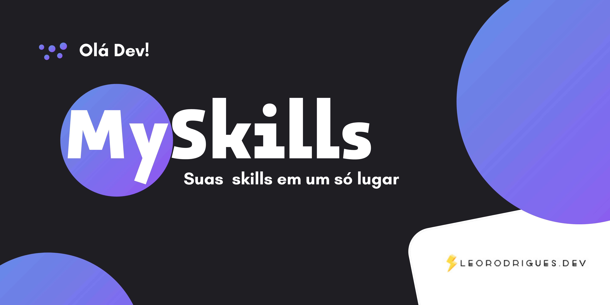
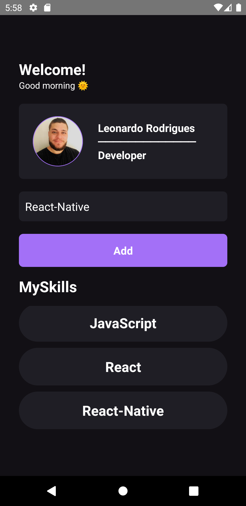

<a alt="README in english language" href="/README-en.md">Click here for README in english language <span>&nbsp;&nbsp; ' </span></a>

<p align="center" >

</p>


<h1 align="center">
     <strong>MySkills
</h1>
<p align="center">👨‍💻 Aplicação cadastro de skills dev. </p>


\
\
[](https://github.com/)
[](https://code.visualstudio.com/)
[](https://www.typescriptlang.org/)
[](https://www.figma.com/)
[](https://github.com/ellerbrock/open-source-badges/)

<a href="https://pt-br.reactjs.org/"></a>
<a href="https://github.com/onLeoRodrigues/mySkills/issues"></a>
<a href="https://github.com/onLeoRodrigues/mySkills/network"></a>
<a href="https://github.com/onLeoRodrigues/mySkills/stargazers"></a>

Guia
=================
<!--ts-->
   * [Sobre](#sobre)
   * [Status do Projeto](#status-do-projeto)
   * [Features](#features)
   * [Pré-requisitos](#pré-requisitos)
   * [Rodando a aplicação](#-rodando-a-aplicação)
   * [Tecnologias](#-tecnologias)
   * [Autor](#autor)
<!--te-->

## Sobre

MySkills é um projeto criado para o desenvolvedor com o cadastro de novas skills.


## Status do Projeto

<h4 align="center"> 
	🚧 MySkills 🚩 Em construção...  🚧
</h4>

## Features


- [x] Cadastro de entrada/saída das skills
- [x] Component Profile
- [ ] Página de login/Welcome

---
<h1 align="center" >
  
</h1>


## Pré-requisitos

Antes de começar, você vai precisar ter instalado em sua máquina as seguintes ferramentas:
[Git](https://git-scm.com) e [Node.js](https://nodejs.org/en/). 
Além disto é bom ter um editor para trabalhar com o código como [VSCode](https://code.visualstudio.com/). Por fim,para emular o App no seu celular você vai precisar fazer o download do Expo app para [IOS](https://apps.apple.com/app/apple-store/id982107779) e [Android](https://play.google.com/store/apps/details?id=host.exp.exponent&referrer=www).

## 🎲 Rodando a aplicação

```bash
# Clone este repositório
$ git clone https://github.com/onLeoRodrigues/mySkills.git

# Acesse a pasta do projeto no terminal/cmd
$ cd mySkills

# Instale as dependências
$ yarn install

# Execute a aplicação em modo de desenvolvimento via aplicativo Expo no seu celular escaneando o QR code que aparecerá no seu navegador 
$ expo start

# Execute a aplicação em modo de desenvolvimento no emulador android ( Dica: Deixar o emulador aberto antes deste comando )
$ expo android

# Execute a aplicação em modo de desenvolvimento no emulador ios
$ expo ios

# Execute a aplicação em modo de desenvolvimento no navegador web
$ expo web

# A aplicação inciará de form automática após o comando em qualquer uma das três opções.
```
## 🛠 Tecnologias

As seguintes ferramentas foram usadas na construção do projeto:

- [Node.js](https://nodejs.org/en/)
- [React-Native Cli](https://reactnative.dev/docs/environment-setup)
- [TypeScript](https://www.typescriptlang.org/)
- [JSX](https://pt-br.reactjs.org/docs/jsx-in-depth.html)
- [Hooks com useState e useEffect](https://pt-br.reactjs.org/docs/hooks-effect.html)                       
- [FlatList](https://reactnative.dev/docs/flatlist)
- [Expo](https://docs.expo.dev/)

## Autor


<a href="https://bio.link/leorodriguesdev">
 
 <br />
 <sub><b>Leonardo Rodrigues</b></sub></a> <a href="https://bio.link/leorodriguesdev" title="link leo">⚡</a>


Feito com ❤️ por Leonardo Rodrigues 👋🏽 Entre em contato!

[](https://twitter.com/leorodriguesdev) [](https://www.linkedin.com/in/on-leorodrigues/) 
[](mailto:leorodriguesoffice@gmail.com)

<p align="left" >

</p>